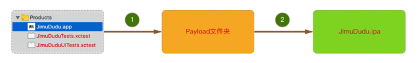
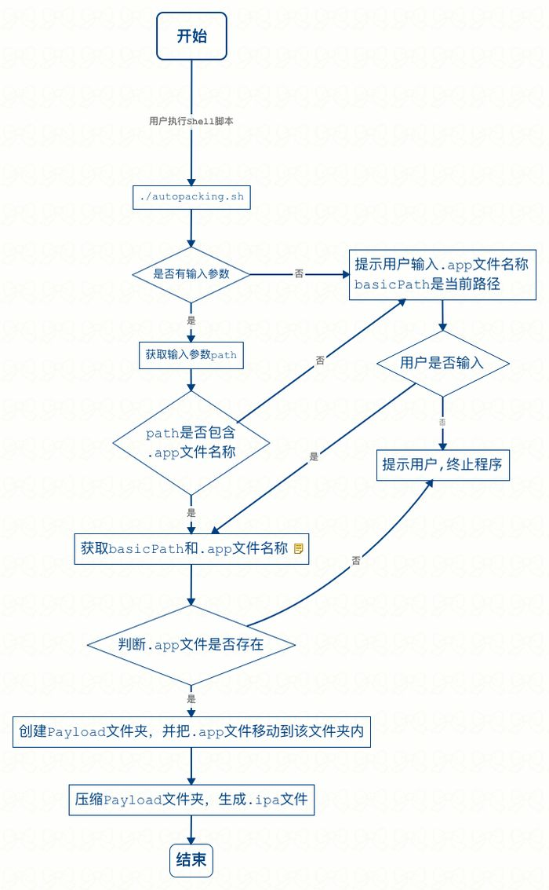

# XCode_CICD

## **方式一: 使用xcodebuild命令**

### 准备工作：基础参数

```
# 项目名称，打包后生成 .ipa 文件的名称

projectName="JimuDudu"

# 项目目录（一般情况下，shell 脚本就在项目路径下）

workspacePath="/Users/apple/Documents/Projects/dudu/jimu-dudu-ios/jimu-dudu/"

# Archive 后，文件导出目录

archivePath="/Users/apple/Desktop/tmp/build/"

# 获取 shell 脚本所在目录
currentPath=$(cd `dirname $0`; pwd)
```


### **Build**

```
xcodebuild -scheme ${projectName} -workspace "${workspacePath}${projectName}.xcworkspace" -configuration Release clean build
```


### **Archive**

```
xcodebuild -scheme ${projectName} -workspace "${workspacePath}${projectName}.xcworkspace" -configuration Release archive -archivePath "${archivePath}${projectName}"
```


###  Export .ipa file

```
xcodebuild -exportArchive -archivePath "${archivePath}${projectName}.xcarchive" -exportPath ${archivePath} -exportOptionsPlist "${currentPath}/ADHocExportOptions.plist"
```


### **总结**

shell 脚本和 plist 文件在一个目录下（也可以不在一个目录，本示例是在一个目录下，一般情况，shell 脚本和 plist 文件都会在项目目录下。）

正常情况，shell 脚本和 plist 文件都会在项目目录下，所以 workspacePath 和 archivePath 等路径，都可以写成相对路径

编译前还有一些准备工作，比如拉取最新代码

这样打包过程很耗时，在本机上测试，大概需要26分钟！

这种方式，可能会跟随 Xcode 版本的升级而略有改变，否则就会报错。


## **方式二: 手动编译，自动打包**

一般打测试包的方式



**说明**

```
手动编译，生成 .app 文件

把 .app 文件放在名字为 Payload 文件夹下

压缩文件夹，生成 .zip 文件

修改文件名：.zip -> ipa，打包完成
```


**步骤**

### 准备工作：修改 Xcode 中的配置

### Build（command + B）

### 执行脚本，自动打包并生成 .ipa 文件


**流程图**



### 主要代码

```
# 创建 Payload 文件夹
payloadPath=${basicPath}/Payload
mkdir -p ${payloadPath}

# 移动 .app 文件到 Payload 目录下
cp -r ${appFileFullPath} ${payloadPath}

# 打包并生成 .ipa 文件
zip -q -r ${ipaFileName} ${payloadPath}
```


### **总结**

执行脚本时，可以传入 .app 文件所在路径，或者不传；不传的话，默认从当前路径获取，获取不到报错

执行脚本时，如果传入的参数不包含 .app 文件名，则需要手动输入，若输入错误，报错，终止程序。

一般而言，shell 脚本配置一次之后，就再也不需要修改。属于一劳永逸的事。


## **方式三: Product -> Archieve -> Export**

一般打提交 App Store 包的时候，会这么操作。